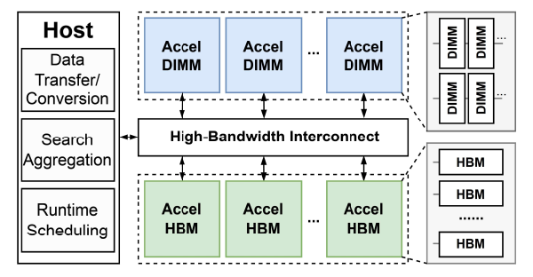
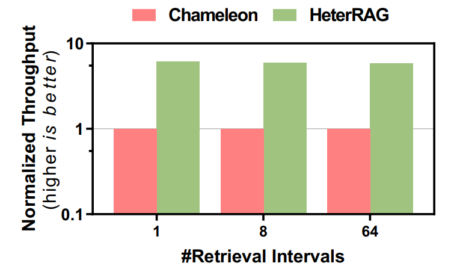
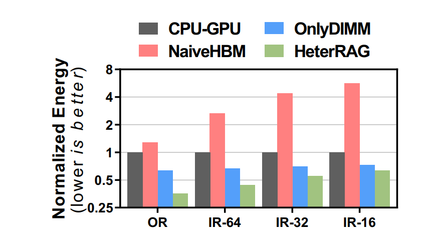
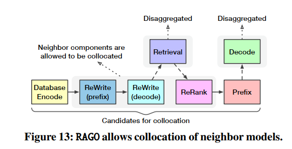
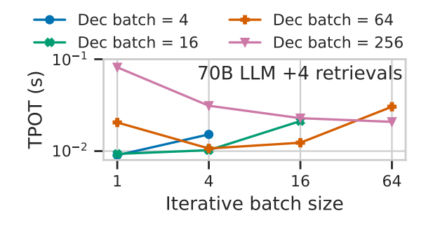
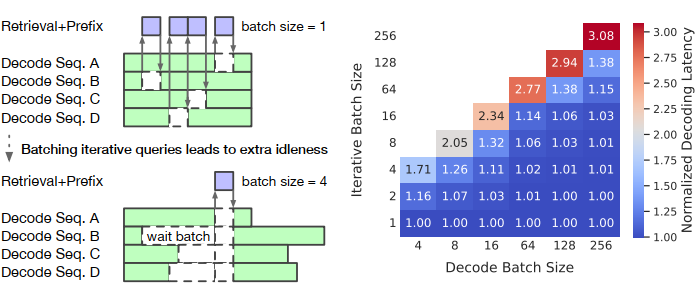

.png)
# HeterRAG 异构 PIM 加速 RAG 系统
## 1.&nbsp;   研究背景

Retrieval-augmented Generation (RAG) 通过结合外部知识库，极大地增强了大型语言模型（LLM）在知识密集型任务上的表现 。

RAG面临问题挑战：

1. 高带宽瓶颈 (Bandwidth Bottleneck):<br>
**检索阶段：** 随机和不规则的内存访问模式导致带宽利用率低下 <br>
**生成阶段：** 涉及大量的通用矩阵向量乘法 (GEMV) 操作，受限于内存带宽 。
2. 高内存瓶颈 (Capacity Bottleneck):<br>
**检索阶段：** 需要维护大规模的知识库（文档、向量、索引），导致巨大的存储开销 。

核心矛盾：

1. **HBM-PIM 方案：** 拥有极高带宽，适合解决“带宽瓶颈”；但容量小、成本高，无法满足 RAG 的“容量瓶颈” 。
2. **DIMM-PIM 方案：** 拥有大容量、低成本，适合解决“容量瓶颈”；但其带宽远低于 HBM，无法满足“带宽瓶颈” 。<br>

> **补充知识：有关 DIMM 与 HBM 的介绍**  
> **PIM**：存内计算（Processing-In-Memory, PIM）<br>
> 基于 **DIMM** 的 PIM：DIMM 采用 DDR 芯片的二维布局，从而降低制造成本，使用户能够以实惠的价格获得大容量内存。  
> 基于 **HBM** 的 PIM：HBM 采用 3D 堆叠结构，通过 TSV 垂直连接，带来高带宽、低延迟和低功耗，但制造成本较高。

<br>


## 2.&nbsp;HeterRAG Architecture



1.主机(Host):<br>
分配“检索”任务给 AccelDIMM，“生成”任务给 AccelHBM
进行数据传输和格式转换
收集所有 AccelDIMM 返回的检索结果

2.互连 (Interconnect)<br>
系统允许你独立地增加 AccelDIMM（用于检索）或 AccelHBM（用于生成）的数量。
定制化连接：可以通过 PCIe 插槽和 CXL 交换机连接不同数量的 PIM 设备，以满足 RAG 系统对“检索容量”或“生成能力”的特定需求

3.AccelDIMM (DIMM 加速器)<br>
离线 (Offline)： 海量（TB 级）的知识库索引被分割成多份，分别存储在不同的 AccelDIMM 设备中。
在线 (Online)： 当查询请求到来时，主机会将请求**“广播”给所有**的 AccelDIMM。
并行处理：所有 AccelDIMM 设备同时、并行地在各自存储的数据中执行搜索，然后各自返回最佳结果给主机。

4.AccelHBM (HBM 加速器)<br>
并行策略：
张量并行 (Tensor Parallelism，默认)： 多个 AccelHBM 同时计算模型权重的不同部分，然后聚合结果。
流水线并行 (Pipeline Parallelism)： 当模型非常大时，将其按层切分成多个阶段，像工厂流水线一样分配给不同的 AccelHBM 按顺序处理。

5.执行流程 (Execution Flow)<br>
[Host] 主机接收查询，将其转换为向量。<br>
[Host → AccelDIMMs] 主机将此向量广播给所有 AccelDIMM。<br>
[AccelDIMMs] (检索) 所有 AccelDIMM 并行搜索，各自返回 Top-k 结果。<br>
[Host] 主机聚合所有结果，排序后得到最终的 Top-k。<br>
[Host] 主机根据向量 ID 找到对应的文档原文，并将其与原始查询打包成 LLM 的输入张量。<br>
[Host → AccelHBMs] 主机将此张量发送给 AccelHBM。<br>
[AccelHBMs] (生成) AccelHBM 执行 LLM 推理，生成最终答案。<br>

## 3.AccelDIMM 硬件架构总结

### 1.核心设计理念：选择性卸载 (Selective Offloading)<br>
AccelDIMM 专为 ANNS（近似最近邻搜索）操作设计。ANNS 包含多个步骤，但并非所有步骤都适合 PIM。

1.不卸载的任务：<br>
 **• 邻居抓取**: 此任务涉及内存访问和结果过滤。但维护一个“已访问节点”列表会引入显著的硬件面积开销，不适合卸载。<br>
**• 队列更新**: 此任务需要对计算结果进行集中聚合和排序，其逻辑不适合 PIM。

2.卸载的任务：<br>
**• 距离计算**: 这是 ANNS 中计算最密集且最易并行的部分。因此，内存卸载严格限制 (restricted) 在此操作。
### 2. 整体架构
.png)<br>
**1.顶层处理模块 (Top-level Processing Module)**<br>
TPM 是 AccelDIMM 的总控制中心，负责管理整个 ANNS 流程。
构成主要包含指令队列、指令解码器 和 功能块 (FB)。
功能：接收并解码主机指令，启动 ANNS 操作。FB 负责管理邻居抓取和队列更新，并生成 PIM 请求以进行距离计算。<br>

**2.内存控制器 (Memory Controller)**<br>
PIM 扩展：集成了 PIM 扩展模块，用于处理 地址映射 和 PIM 指令生成。<br>

**3.PIM-enabled DIMM (启用 PIM 的内存条)**<br>
执行存内计算的核心硬件。<br>
关键设计决策 (Rank-level vs. Bank-level)：Bank 级部署计算,将导致大量计算资源空闲和更高的面积开销。因此，本设计选择在**Rank 级**（更大的内存单元）部署距离计算模块，以提高效率。


**(a) DIMM 级处理模块 (DPM)**<br>
从顶层模块 (TPM) 接收 PIM 指令，然后根据指令中的“Rank ID”，将任务分发给对应的 Rank 级处理模块 (RPM)。它内部有专用缓冲区，用来临时存储所有 RPM 完成的计算结果。它以“轮询”的方式，将收集到的结果通过标准内存接口传回给 AccelDIMM 的顶层模块 (TPM) 进行排序。   
**(b)Rank 级处理模块 (RPM)**<br>
每个 Rank 都配有一个，因此它们可以并行处理任务，主要负责解码与缓存，并执行计算距离。比较巧妙的地方它并不直接从DRAM取数据，而是先检查本地高速缓存，如果缓存命中：直接将向量数据送去计算，如果缓存未命中：它会自动生成标准 DDR 命令，拿取数据进行计算，

## 4.&nbsp;AccelHBM 硬件架构
### 1.核心设计理念<br>
AccelHBM 专为 LLM（大语言模型）推理的“生成”阶段设计。其核心策略是在“操作级别 (operation level)”进行加速，即对 LLM 中的不同运算类型进行区别处理。
LLM 推理主要涉及三类操作：<br>

**1.GEMM (矩阵-矩阵乘法)**<br>
计算逻辑更复杂或计算更密集，这些操作在内存之外处理，即在 AccelHBM 的顶层处理模块 (TPM) 上执行。<br>
**2.GEMV (矩阵-向量乘法)**<br>
GEMV 具有**低算术强度**,是典型的“内存带宽受限”操作,完全卸载到 PIM-HBM 内存中执行。<br>
**3.其他操作** (如 LayerNorm, RMSNorm, Softmax 等元素级计算和归一化)<br>

### 2.顶层处理模块 (Top-level Processing Module)
TPM 是 AccelHBM 的“大脑”和“本地计算单元”，其内部的功能块 (Functional Block - FB) 负责处理所有未卸载到内存的任务。<br>

<p style="text-align:center">
  
</p>

### 3.PIM-enabled HBM <br>
负责存储模型权重、KV 缓存，并在内存中就地执行 GEMV。<br>
1.关键架构差异 (vs. AccelDIMM)：

&nbsp; &nbsp; &nbsp; **AccelDIMM (检索)：** 由于 ANNS 访问模式稀疏，采用 Rank-level (Rank 级) 部署计算单元。

&nbsp; &nbsp; &nbsp; **AccelHBM (生成)：** 为了最大化计算效率，借鉴 Newton等先进设计，采用 Bank-level (Bank 级) 部署处理模块。

&nbsp; &nbsp; &nbsp; **Bank 级处理模块 (BPM)：**
是 HBM 内部的实际计算单元
每个 BPM 包含两个用于向量内积 (vector inner product) 操作的计算单元


## 5.&nbsp;HeterRAG 的软件硬件协同优化与系统设计
### 1.RAG 系统的两大系统级瓶颈<br>
**•数据局部性**: RAG 系统存在高度局部性（少数文档被高频访问，且迭代查询常复用文档），但现有系统未利用此特性，导致冗余计算和数据传输。<br>
**•严格串行:** “检索”和“生成”阶段必须串行执行，导致硬件（AccelDIMM 或 AccelHBM）空闲，利用率低下。
### 2.三大软件硬件协同优化方案
**1.感知局部性的检索**<br>
&nbsp;&nbsp;&nbsp;• 硬件优化 (RPM 缓存): 在 AccelDIMM 的 RPM 模块中增加了向量缓存 (vertex vector cache)，用于缓存高频访问的向量，减少DRAM访问。<br>
&nbsp;&nbsp;&nbsp;• 软件优化 (迭代加速): 在迭代 RAG 场景中，复用上一轮的搜索结果作为新一轮搜索的“起始点”，加速搜索收敛。

**2.感知局部性的生成**<br>
&nbsp;&nbsp;&nbsp;• 核心问题: 解决 LLM 生成 (Prefilling 阶段) 中 KV 缓存的冗余计算和高内存占用问题。<br>
&nbsp;&nbsp;&nbsp;• 解决方案 (前缀树 + 选择性计算):<br>
&nbsp;&nbsp;&nbsp; &nbsp;&nbsp;&nbsp;• 1.使用前缀树 (Prefix Tree) 来组织文档序列。<br>
&nbsp;&nbsp;&nbsp; &nbsp;&nbsp;&nbsp;• 2.将 KV 缓存拆分为**稠密**(文档固有，只存一份)和**稀疏**（序列相关，只存 10-20% 的重要 Token）。<br>
&nbsp;&nbsp;&nbsp;• 硬件支持: 在 AccelHBM 的 TPM 中增加了三个专用硬件（树搜索单元、KV 替换单元、Token 过滤单元）来高效执行此方案。<br>
**3.细粒度并行流水线**<br>
&nbsp;&nbsp;&nbsp;• 核心目标: 打破检索和生成的串行依赖，实现两个阶段的执行重叠 (Overlap)。<br>
&nbsp;&nbsp;&nbsp;• 解决方案: 主机 (Host) 不再等待所有检索任务完成，而是定期汇总。它会提前发送那些“已完成”或“高置信度”的部分检索结果给 AccelHBM，使其“抢跑”生成任务，从而隐藏检索延迟，提升系统总吞吐量。

通用性：HeterRAG 的异构 PIM 架构（高带宽 HBM + 大容量 DIMM）并不仅仅局限于 RAG，它适用于任何**同时需要高内存带宽和大内存容量**的应用。
该架构的硬件支持如图遍历、GEMM 和 GEMV 等多种基础运算，使其具备运行图神经网络 (GNNs) 等更广泛应用的能力
## 6. &nbsp;实验评估：
| 模型名称    | 参数规模 | 说明                  |
|-------------|----------|-----------------------|
| GPT-2 XL    | 1.5B     | 基础大型语言模型      |
| LLaMA2-7B   | 7B       | 中型模型，用于性能测试 |
| LLaMA2-70B  | 70B      | 超大模型，用于可扩展性评估 |

| 数据集名称             | 缩写   | 数据类型   | 简要说明       |
| ----------------- | ---- | ------ | ---------- |
| WIKI-QA           | WIKI | 问答型文本  | 基于维基百科的问答对 |
| Web Questions     | WEB  | 网络问答   | 来源于真实网页查询  |
| Natural Questions | NQ   | 自然语言问答 | 谷歌搜索问题数据集  |
| Trivia-QA         | TQ   | 知识问答   | 基于百科与问答网站  |


| 系统方案     | 描述              | 特点说明        |
| -------- | --------------- | ----------- |
| CPU-GPU  | 传统 CPU + GPU 架构 | 真实系统基准性能测试  |
| NaiveHBM | 仅 HBM-PIM 方案    | 高带宽内存加速计算   |
| OnlyDIMM | 仅 DIMM-PIM 方案   | 大容量、近存储计算特性 |

<p style="text-align:center">
  
</p>

**•吞吐量**<br>
<p style="text-align:center">
  
</p>

**•延迟**<br>
<p style="text-align:center">
  
</p><br>

**•能效**
<p style="text-align:center">
  
</p>
<br>


# RAGO  面向 RAG 服务的系统性性能优化
## 1.简介：问题与贡献
RAG服务在部署时面临三个核心挑战:<br>
**系统异构性：** RAG 系统包含众多异构组件（如向量搜索、LLM、数据库编码器、查询重写器、结果重排器等）。<br>
**性能可变性：** 不同的 RAG 配置（如数据库大小、检索频率、模型选择）导致性能差异巨大，系统瓶颈可能在检索和推理之间“漂移” 。<br>
**优化挑战：** 这种异构性和可变性使得设计高效的 RAG 服务系统（即如何制定调度策略）变得极其困难

## 2.RAGSchema介绍
RAGSchema 是 RAGO 框架的基础，是一个结构化和模块化的抽象 ，用于捕获各种 RAG 服务工作负载的关键性能相关属性 ，同时也是一种 RAG 服务抽象，它封装了一组基本的、与性能相关的工作负载属性 。它同时被视为一种结构化抽象，捕获了广泛的 RAG 算法，并作为性能优化的基础 。
主要包括:
1. 管道的执行流程，包含哪些可选组件。<br>
2. 组件的配置。<br>
## 3.RAGO 框架如何工作？
### 3.1 &nbsp;高层次性能权衡模型 (High-level Trade-off Model)

首先对 RAG 管道中的关键组件（推理和检索）进行性能建模，以进行高层次的权衡分析：<br>
**[I]推理组件 (Inference)：**<br>
对于一个模型大小为 $M$、序列长度为 $L$ 的推理任务（$L$ 较短时），其计算量 (FLOPs) 约等于：

<div align="center">

$FLOPs_{inference}\approx2 \cdot M \cdot L$ 

</div>


**[II]检索组件 (Retrieval)：**<br> 检索工作负载由每个查询访问的数据库向量字节数来近似描述。给定 $N_{dbvec}$ 个数据库向量，每个向量 $B_{vec}$ 字节，每个查询扫描 $P_{scan}$ 百分比的向量，总字节数约等于：<br>
<div align="center">

$B_{retrieval}\approx N_{dbvec}\cdot B_{vec}\cdot\frac{P_{scan}}{100}$ 
</div>

**[III]端到端吞吐量 (End-to-end RAG performance)：**<br>
 RAG 管道的吞吐量由其最慢的阶段（瓶颈）决定 。论文中给出的 $m$ 个阶段的吞吐量公式为：
 <div align="center">

 $QPS_{RAG}=min(QPS_{1},QPS_{2},...,QPS_{m})$ 42

</div>

### 3.2&nbsp;RAGO 调度决策(RAGO Scheduling Decisions)<br>
RAGO 框架通过优化以下三个维度的决策来生成最优调度方案 ：<br>
**[I] 任务放置(Task placement)：**<br>
RAG 管道包含多个模型组件（如查询重写、重排、前缀计算等）。RAGO 决定是将这些组件并置在同一组 XPU 上，还是将它们解耦到不同的 XPU 集群上。

<br>

Figure 13  展示了 RAGO 的放置策略。它允许管道中相邻的阶段（如 Database Encode, ReWrite, ReRank, Prefix）进行并置 ，但 Retrieval（运行在 CPU）和 Decode（解码）阶段总是解耦的 。


**[II] 资源分配(Resource allocation)**：<br>
在确定放置策略后，RAGO 为每个（并置或解耦的）流水线阶段分配计算资源。<br>
这包括为推理任务分配 XPU 的数量 ，以及为检索任务分配 CPU 服务器的数量 ，同时确保满足内存容量需求 。<br>

**[III] 批处理策略(Batching policy)**：
RAGO 为管道中的每个阶段启用可变的批处理大小 (batch sizes) ，以在延迟和吞吐量之间进行权衡 。<br>
例如，它支持微批处理 (micro-batches) 以及在解码阶段使用连续批处理 (continuous batching) 。<br>


### 3.3 &nbsp;搜索最优调度 
RAGO 通过一个三步的穷举搜索过程  来找到最优调度：

**[I]性能分析 (Performance Profiling)：**  首先，RAGO 使用分析模型独立评估 RAGSchema 中每个阶段（如检索、前缀、解码等）在不同资源分配和批处理大小下的性能 。

**[II]调度生成 (Schedule Generation)：**  RAGO 生成所有可能的调度组合，遍历 (a) 放置策略，(b) 资源分配策略，和 (c) 批处理策略 。

**[III]端到端性能评估：**  RAGO 计算每个组合调度的端到端性能（TTFT, QPS/Chip），并识别出帕累托前沿（即最优的权衡曲线）。

## 4.&nbsp;结论：
RAG 的瓶颈是动态变化的
Case I (超大规模检索)： 瓶颈是检索 (Retrieval) 。当使用 8B LLM 时，检索占了 80% 以上的时间 。

<p style="text-align:center">
  
</p>
Case II (长上下文处理)： 瓶颈不是检索（占比 < 1%），而是数据库编码 (Database Encode) 。一个 120M 的编码器模型，由于要处理的 Token 太多，其开销甚至超过了 70B 的 LLM 。
<p style="text-align:center">
  
</p>

Case III (迭代检索)： 瓶颈在于解码阶段的空闲 (idleness) 。解码器需要暂停，等待凑齐一个批次的迭代检索请求，导致 TPOT（每 Token 延迟）大幅增加 。

<p style="text-align:center">
  
</p>


Case IV (查询重写器)： 瓶颈是查询重写器 (Query Rewriter) 导致的 TTFT（首个 Token 延迟）增加 。因为它是一个自回归模型，必须串行执行，导致 TTFT 增加了 2.4 倍 。


# RAGFlow 工具介绍
开源项目地址：https://github.com/infiniflow/ragflow<br>
## 一、工具简介

RAGFlow 是一个开源的 Retrieval-Augmented Generation（RAG）引擎，基于“深度文档理解”（deep document understanding）设计，旨在把复杂多样的文档数据转化为可供大语言模型（LLM）使用的高质量上下文层。其定位是“企业级可用”、“流程化可部署”的 RAG 解决方案。 

主要特点包括：<br>

&nbsp;&nbsp;&nbsp;**•** 支持大规模、多格式的文档输入（Word、Excel、PPT、扫描件、结构化＋非结构化数据）<br>
&nbsp;&nbsp;&nbsp;**•** 提供“检索＋生成”完整流程，并结合 Agent（智能代理／流程控制）能力<br>
&nbsp;&nbsp;&nbsp;**•** 强调引用可追溯、降低幻觉（hallucination）风险、提升生成质量。<br>

##  二、核心功能

---

### 🔹 功能 1：文档理解 + 异构数据支持

- **支持多种数据源／格式：**  
  Word 文档、幻灯片、Excel、纯文本、图片、扫描件、网页、结构化数据等。

- **深度理解文档结构：**  
  能识别表格、图片、扫描件、版面结构、段落标题、目录等信息，从而生成更合理的“切片”（chunking）用于后续检索。

- **模板化切块（Template-based Chunking）：**  
  每份文档可按照合理逻辑（例如按章节、目录、版面）被分成多个检索单元。  
  这样，即使资料“格式混乱”或“含有图片表格”，也能被检索与问答系统充分利用，而不仅限于纯文本。

---

### 🔹 功能 2：检索＋重排序＋生成（RAG Workflow）

- **检索（Recall）：**  
  将文档切块后建立索引／向量数据库，用户查询时先检索相关片段。

- **重排序（Re-ranking）：**  
  对初步检索结果进行排序优化，使最相关内容优先展示。

- **生成（Generation）：**  
  将检索片段作为上下文输入至 LLM（可配置模型），生成带有引用出处的可靠答案。

- **引用机制：**  
  RAGFlow 支持“有依据地回答”，可附带参考片段、页码、来源信息，降低模型幻觉。

- **端到端自动化：**  
  从文档导入（ingest）到查询接口、到聊天／助手模式，整个流程可自动化执行。

---

### 🔹 Agent 模板／工作流支持

- **可配置的 Agent 模板：**  
  除了“纯检索问答”，RAGFlow 提供 Agent 模板，可执行多步推理、工具调用、代码执行、甚至 Web 搜索。

- **可视化工作流构建：**  
  用户可在 UI 中通过拖拽节点的方式直观地构建 Agent 工作流，降低开发与集成门槛。

---

### 🔹 易用性 & 可集成性

- **Web UI：**  
  通过图形界面上传文档、管理知识库、创建助手或 Agent。

- **API 接口：**  
  提供 HTTP 与 SDK 调用方式，可在现有系统或产品中集成 RAG 功能。

- **多模型支持：**  
  可配置为使用 OpenAI 等云端模型，也可部署本地 LLM，灵活适配不同环境。

- **快速部署：**  
  支持 Docker，一键运行。  
  提供精简版（slim）与完整版镜像，满足不同部署需求。
## 三、本地配置流程
---

### 🔹 步骤 1：安装 Docker Desktop

1. 下载并安装 **Docker Desktop for Windows**。  
   安装完成后，确保 Docker 服务已启动。


---

### 🔹 步骤 2：启动 RAGFlow 服务

1. 进入项目所在文件夹。  
2. 顺序执行以下命令：

   ```bash
   docker compose up -d
   docker logs -f ragflow-server


### 🔹 步骤 3：访问 UI 界面

1. 复制终端输出中的访问网址。

2. 在浏览器中打开即可进入 RAGFlow 的 Web UI。<br>


